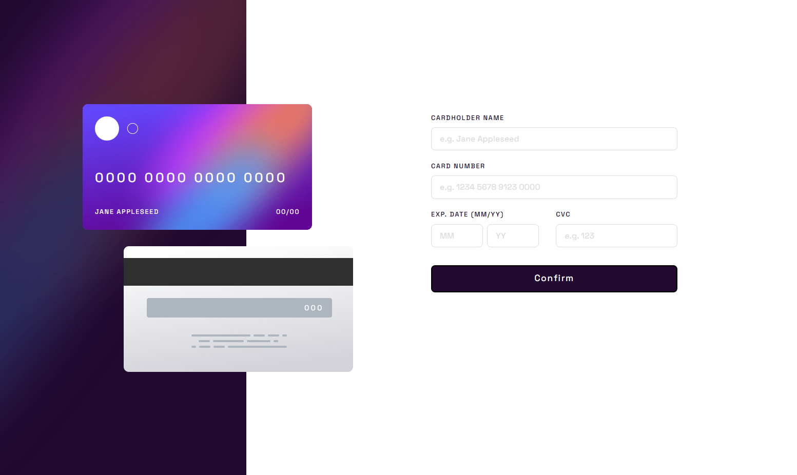
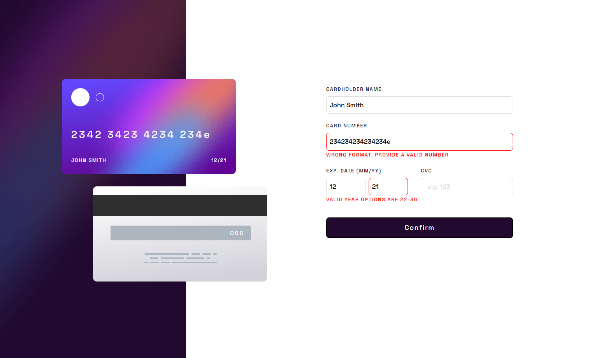
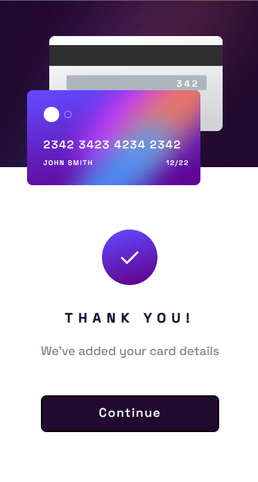

# Frontend Mentor - Interactive card details form solution

This is a solution to the [Interactive card details form challenge on Frontend Mentor](https://www.frontendmentor.io/challenges/interactive-card-details-form-XpS8cKZDWw). Frontend Mentor challenges help you improve your coding skills by building realistic projects.

## Table of contents

- [Overview](#overview)
  - [The challenge](#the-challenge)
  - [Screenshot](#screenshot)
  - [Links](#links)
- [My process](#my-process)
  - [Built with](#built-with)
  - [What I learned](#what-i-learned)
  - [Continued development](#continued-development)
- [Author](#author)

**Note: Delete this note and update the table of contents based on what sections you keep.**

## Overview

### The challenge

Users should be able to:

- Fill in the form and see the card details update in real-time
- Receive error messages when the form is submitted if:
  - Any input field is empty
  - The card number, expiry date, or CVC fields are in the wrong format
- View the optimal layout depending on their device's screen size
- See hover, active, and focus states for interactive elements on the page

### Screenshot






### Links

- Live Site URL: [Github Pages](https://mattzavada.github.io/Frontend-Mentor/interactive-card-details-form-main/)

## My process

Worked on layout. Used flexbox for cards and grid for form. Had to do some off-setting to get the cards lined up correctly. Also used grid for the front card text.
Created functions for validating each input, copying the text from the input to the card in real time, and intercepting the form submittal to validate before replacing form with success message.

### Built with

- CSS custom properties
- Flexbox
- CSS Grid
- JavaScript

### What I learned

Learned to use RegEx for validating form input.

```js
//Used to validate card number
if (
    !/^(?:4[0-9]{12}(?:[0-9]{3})?|[25][1-7][0-9]{14}|6(?:011|5[0-9][0-9])[0-9]{12}|3[47][0-9]{13}|3(?:0[0-5]|[68][0-9])[0-9]{11}|(?:2131|1800|35\d{3})\d{11})$/.test(
      formCardNumber.value
    )

//Month validation
if (!/^((0[1-9])|(1[0-2]))$/.test(formCardMonth.value))

```

### Continued development

Work on getting better at class naming to keep better organized. Learn more about manipulating the DOM with JS.

## Author

- Website - [Matthew Zavada](https://mattzavada.github.io/)
- Frontend Mentor - [@mattzavada](https://www.frontendmentor.io/profile/mattzavada)
