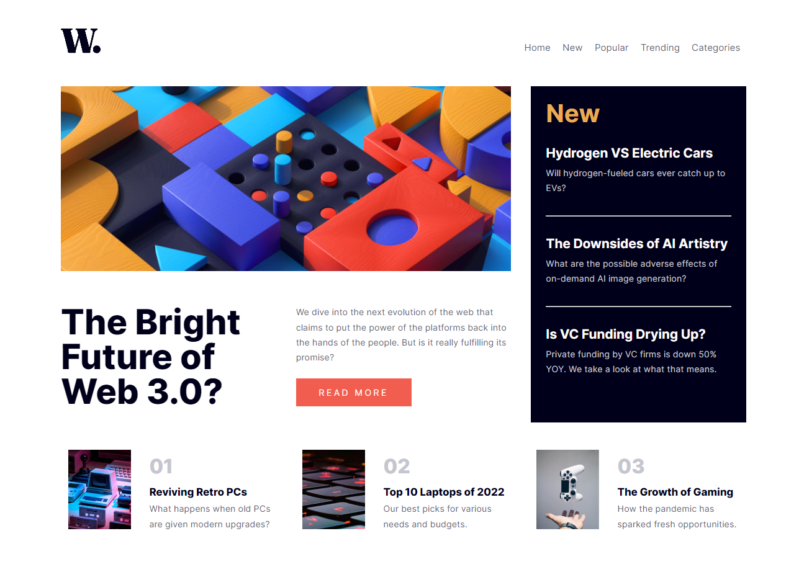
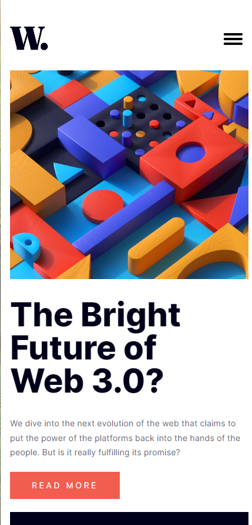
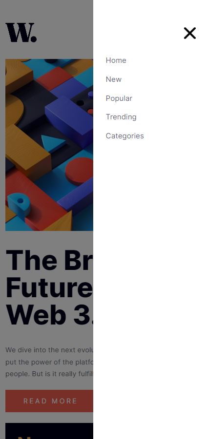

# Frontend Mentor - News homepage solution

This is a solution to the [News homepage challenge on Frontend Mentor](https://www.frontendmentor.io/challenges/news-homepage-H6SWTa1MFl). Frontend Mentor challenges help you improve your coding skills by building realistic projects. 

## Table of contents

- [Overview](#overview)
  - [The challenge](#the-challenge)
  - [Screenshot](#screenshot)
  - [Links](#links)
- [My process](#my-process)
  - [Built with](#built-with)
  - [What I learned](#what-i-learned)
  - [Continued development](#continued-development)
  - [Useful resources](#useful-resources)
- [Author](#author)

## Overview

### The challenge

Users should be able to:

- View the optimal layout for the interface depending on their device's screen size
- See hover and focus states for all interactive elements on the page
- **Bonus**: Toggle the mobile menu (requires some JavaScript)

### Screenshot





### Links

- Solution URL: [Link](https://github.com/mattzavada/mattzavada.github.io/tree/main/Frontend-Mentor/news-homepage-main)
- Live Site URL: [Link](https://mattzavada.github.io/Frontend-Mentor/news-homepage-main/)

## My process

  Added semantic tags to HTML to group areas of the page. Did some research to see what tags I might be able to use with the design. Used the picture tag to account for two different hero images based on eventual break points.

  Examined layout to see where I could use Grid and Flexbox. Added layout to CSS for desktop view first since this was more complicated as I knew mobile would be a single column layout. 

  Added styling to elements based on style designs. Worked to ensure the styling matched as viewport changed in size. Decided to add a third break point in the middle as content was not looking good as the viewport shrinked. Decided to go with grid areas to make it easier to change layout.

  For mobile navigation I decided to restyle the current navigation menu instead of creating a duplicate. This was a nice changelle in changing positioning and visibility. Followed a tutorial from Kevin Powell on how to animate an svg for the hamburger button. Still have a lot to learn about svg's. 

  Researched how to use Javascript to add and remove classes and styling to CSS classes. Also learned about grabbing the aria-enabled attribute value to help with the navigation toggle between enabled and not. Was able to use the one function to activate the svg animation, slide out the navigation panel and to add a overlay to the page behind the panel. 

### Built with

- Semantic HTML5 markup
- CSS custom properties
- Flexbox
- CSS Grid
- JavaScript
- SVG animation

### What I learned

Learned about creating SVG's and animating them. Not the easiest to understand.

Got some practice in using CSS Grid template areas. This was a nice easy way to edit layouts quickly. Happy with reusing the desktop navigation for the mobile navigation panel. Changing its appearance, styling, and animating it by adding a class to change it's position.

Happy that my research helped me to find solutions to transitions, animated navigation button, and changing classes and attributes in Javascript to make it all work.

```html
<button class="navigationbutton" aria-controls="navigation" aria-expanded="false">
          <svg class="hamburger" viewBox="0 0 100 100" width="40">
            <rect class="line ham_top" 
                  width="80" height="10"
                  x="10" y="25" rx="5">
            </rect>
            <rect class="line ham_middle" 
                  width="80" height="10"
                  x="10" y="45" rx="5">
            </rect>
            <rect class="line ham_bottom" 
                  width="80" height="10"
                  x="10" y="65" rx="5">
            </rect>
          </svg>
        </button>
        
```
```css
.navigation{
    position:absolute;
    height: 100%;
    margin-top: -3rem; /*Move up outside of grid context */
    padding: 7rem 1rem;
    width: 15rem;
    right: -15rem;

    flex-direction: column; 
    justify-content: flex-start; 
    gap: .8rem; 

    background-color: white;
    transition: right 1s;

    z-index: 2; /* Brings above dark overlay */
  }

  .slide-nav-out{
      right: 0rem; /* Change position from side with transition */
    }
```
```js
nav_button.addEventListener('click', ()=> {

  const isOpened = nav_button.getAttribute('aria-expanded');

  if(isOpened === 'false'){

    nav_button.setAttribute('aria-expanded','true');

    nav_panel.classList.add('slide-nav-out');

    overlay.style.display = "block";

  } else {

    nav_button.setAttribute('aria-expanded', 'false');

    nav_panel.classList.remove('slide-nav-out');

    overlay.style.display = "none";

  }
});
```

### Continued development

Have a lot to learn about positioning elements correctly and changing these as the viewport changes. I haven't worked with JavaScript in some time so getting used to how this works and can manipulate the DOM is fun. 

### Useful resources

- [Animated Hamburger Icon](https://www.youtube.com/watch?v=R00QiudbD4Y&t=3164s) - This helped me to use an animated SVG instead of just using the svg files that came with the project.

- [W3 Schools](https://www.w3schools.com/howto/howto_css_overlay.asp) - This gave me the idea for how to handle the dark overlay

## Author

- Website - [Matthew Zavada](https://mattzavada.github.io/)
- Frontend Mentor - [@mattzavada](https://www.frontendmentor.io/profile/yourusername)


