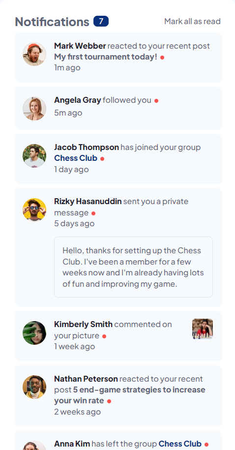

# Frontend Mentor - Notifications page solution

This is a solution to the [Notifications page challenge on Frontend Mentor](https://www.frontendmentor.io/challenges/notifications-page-DqK5QAmKbC). Frontend Mentor challenges help you improve your coding skills by building realistic projects.

## Table of contents

- [Overview](#overview)
  - [The challenge](#the-challenge)
  - [Screenshot](#screenshot)
  - [Links](#links)
- [My process](#my-process)
  - [Built with](#built-with)
  - [What I learned](#what-i-learned)
  - [Continued development](#continued-development)
  - [Useful resources](#useful-resources)
- [Author](#author)

## Overview

### The challenge

Users should be able to:

- Distinguish between "unread" and "read" notifications
- Select "Mark all as read" to toggle the visual state of the unread notifications and set the number of unread messages to zero
- View the optimal layout for the interface depending on their device's screen size
- See hover and focus states for all interactive elements on the page

### Screenshot




### Links

- Solution URL: [GitHub](https://github.com/mattzavada/mattzavada.github.io/tree/main/Frontend-Mentor/notifications-page-main)
- Live Site URL: [Live Site](https://mattzavada.github.io/Frontend-Mentor/notifications-page-main/)

## My process

Examined provided design to determine what structure is needed for the HTML. Noticed that the page does not stand on its own and would likely be a component on a page. Decided to wrap all code in a section tag to house all the content. Within the section are sections for various types of notifications - reactions, followed, people joining or leaving a group, private messages, comments on pictures.

Shared styles between all section cards - header: profile picture, name associated with notification, description of action, title of the item the action was taken on, timestamp. Unread messages have background color and red dot at the end of the notification header. Private messages are subset of the notification header.

Since all notifications have the potential to be unread, added a span tag to toggle based on data-unread attribute. Set aria role to status.

Notification header area lines up nicely with sides of notification cards. Will use CSS grid to layout the header and cards.

For the JS I loaded all notification cards into a node list. I then looped through the list to add an evenlistener to each section so when that item is click the data attribute will update changin the style and remove the notification dot.

To track the number of unread messages left I had to copy the nodelist as an array to be able to use the pop method to remove one item each time and recalculate the number left to update the label. I did this to avoid having to rescan the DOM each time.

Broke out functions for marking an item as read and then built on this to use the same function in a loop to mark them all as read.

### Built with

- Semantic HTML5 markup
- HTML data attributes
- CSS custom properties
- Flexbox
- CSS Grid
- Vanilla Javascript

### What I learned

Adding an eventlistener to all items in a nodelist.

```js
function addClickEvents() {
  unreadMessages.forEach((item) => {
    item.addEventListener("click", (event) => {
      markAsRead(item);
    });
  };
};
```

### Continued development

Learn better practices with class naming and using the right selector for the styling. Learn more about JS.

### Useful resources

- Many various resources

## Author

- Website - [Matthew Zavada](https://mattzavada.github.io/)
- Frontend Mentor - [@mattzavada](https://www.frontendmentor.io/profile/yourusername)
