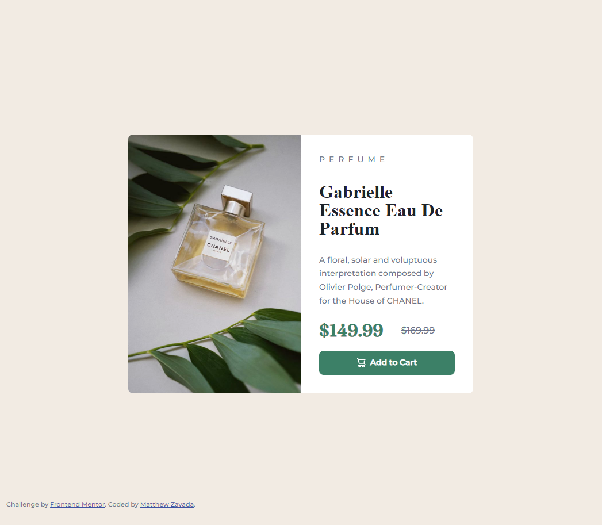
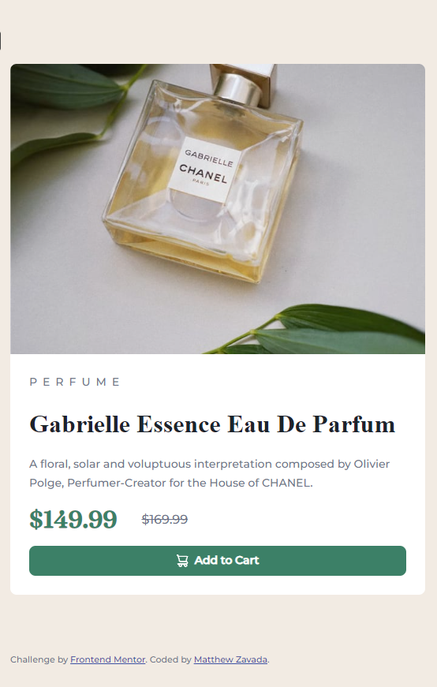

# Frontend Mentor - Product preview card component solution

This is a solution to the [Product preview card component challenge on Frontend Mentor](https://www.frontendmentor.io/challenges/product-preview-card-component-GO7UmttRfa). Frontend Mentor challenges help you improve your coding skills by building realistic projects. 

## Table of contents

- [Overview](#overview)
  - [The challenge](#the-challenge)
  - [Screenshot](#screenshot)
  - [Links](#links)
- [My process](#my-process)
  - [Built with](#built-with)
  - [What I learned](#what-i-learned)
  - [Continued development](#continued-development)
  - [Useful resources](#useful-resources)
- [Author](#author)


## Overview

### The challenge

Users should be able to:

- View the optimal layout depending on their device's screen size
- See hover and focus states for interactive elements

### Screenshot





### Links

- Live Site URL: [Add live site URL here](https://mattzavada.github.io/Frontend-Mentor/product-preview-card-component-main/)

## My process

### Built with

- Semantic HTML5 markup
- CSS custom properties
- Flexbox
- CSS Grid
- Mobile-first workflow


### What I learned

Continued to learn how to recongize where CSS Grid and Flexbox could be used. Also learned about CSS locally scoped variables and how they can be used to assist with edits to multiple areas. Added reset code.

Also learned a little about data attribute to store data on the HTML element and then use this in CSS to set the appropriate image for the button.

Googled how to replace a picture based on screen size and learned about the picture tag and the srcset attribute. Also tried to use more semantic tags and less div's.

```html
<picture class="image">
  <source media="(max-width: 599px)" srcset="./images/image-product-mobile.jpg">
  <source media="(min-width: 600px)" srcset="./images/image-product-desktop.jpg">
  
</picture>
```
```css
.container{
  --content-padding: 1.5rem;
  --content-spacing: .5rem;
}

```

### Continued development

Continue to work on my ability to recongize where and how to use grid and flexbox based on the layout of the design. Learn more about sematic HTML. 

### Useful resources

- [Kevin Powell](https://www.youtube.com/watch?v=B2WL6KkqhLQ&t=2223s) - Kevin's solution gave me a number of ideas to improve my initial solution and solve the problem of having different layout based on screen size.


## Author

- Website - [Matthew Zavada](https://mattzavada.github.io/)
- Frontend Mentor - [@mattzavada](https://www.frontendmentor.io/profile/mattzavada)

